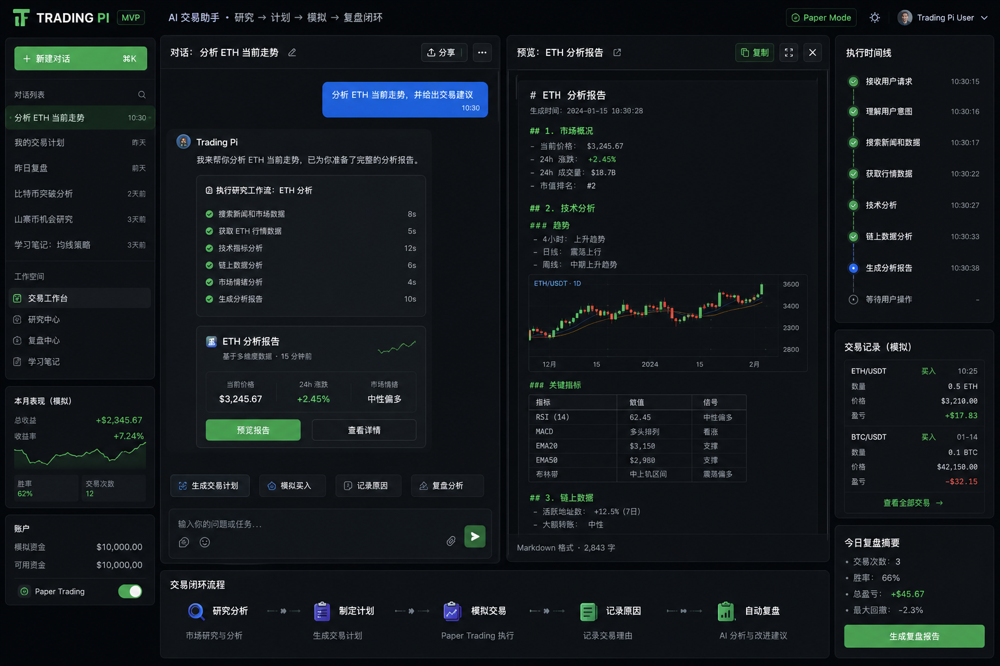

# Trading Pi OS — AI-Powered Trading Terminal

<p align="center">
  <strong>A local-first, single-agent AI trading terminal built with React, Node.js, and monorepo architecture.</strong>
</p>

<p align="center">
  
</p>

---

## What It Does

Trading Pi OS is a **personal AI trading terminal** that runs entirely locally — chat with an AI agent to analyze markets, create trade plans, run backtests, journal trades, and manage a paper portfolio. Everything stays on your machine: SQLite for persistence, JSONL for sessions, and file-based artifacts. No cloud dependency except your chosen LLM provider (OpenAI-compatible).

**One-liner**: *Bloomberg Terminal meets Claude Code, running in your browser.*

---

## Features

### AI Chat
| Feature | Details |
|---------|---------|
| **SSE Streaming** | Real-time token-by-token streaming via Server-Sent Events |
| **Thinking Levels** | `off` / `minimal` / `low` / `medium` / `high` / `xhigh` (token budgets: 0–32768) |
| **Tool Calls** | Agent invokes 40+ skills (market data, search, browser, risk, research, etc.) |
| **Reasoning Display** | Expandable thinking/reasoning blocks in chat messages |
| **Slash Commands** | `/research`, `/plan`, `/review-day`, `/backtest`, `/browser`, `/evolve`, `/bootstrap-os` |

### Memory System
| Feature | Details |
|---------|---------|
| **8 Domains** | conversation, market, trade, review, skill, workspace, research, strategy |
| **Storage** | Short-term (session context) + Long-term (SQLite `memory_records` table) |
| **Semantic Search** | Query by domain/workspace via `POST /api/memory/query` |
| **Importance Scoring** | 0.0–1.0 importance rating per record |

### Session Management
| Feature | Details |
|---------|---------|
| **Create** | Auto-created on first message or explicit new session |
| **Switch** | Click session in sidebar to load history |
| **Delete** | Hover → trash icon → confirm |
| **History** | JSONL files + SQLite metadata, loaded via `GET /api/messages` |

### Artifacts & Plans
| Feature | Details |
|---------|---------|
| **Agent Reports** | Research reports, trade plans, backtest results, review summaries |
| **Artifact Panel** | Claude-style sidebar panel (`ArtifactPanel.tsx`) |
| **Plan Cards** | CRUD operations via `plans` table + API endpoints |
| **Storage** | File-based content + SQLite metadata |

### Export
| Format | Method |
|--------|--------|
| **HTML** | Styled dark-theme HTML with role-colored messages |
| **Markdown** | Structured MD with thinking collapsibles |
| **PDF** | Via `html2pdf.js`, A4 portrait, JetBrains Mono font |

### Dashboard
- Real-time stats grid (agent status, PnL, trade count, model, thinking level)
- Agent status detail panel (status, model, thinking, compaction, session name)
- Recent trades table (last 5, symbol/side/PnL)
- Memory summary block

### Timeline
- Event log from all agent activities (tool calls, workflow runs, compaction)
- Status filter pills: All / Completed / Running / Error
- Text search across event titles and types
- Animated status dots (pulse for running)

### Settings
- **Appearance**: Theme (system/light/dark), Show thinking toggle
- **Session**: Name input, Auto-compaction toggle
- **Agent**: Thinking level selector (off→xhigh), Model info (read-only)
- **Auth**: Toggle (future)

---

## Tech Stack

| Layer | Technology | Version |
|-------|------------|---------|
| **Frontend Framework** | React | 19.2.7 |
| **Build Tool** | Vite | 7.2.7 |
| **CSS** | Tailwind CSS v4 | 4.3.0 |
| **Router** | @tanstack/react-router | 1.170.15 |
| **Data Fetching** | @tanstack/react-query | 5.101.0 |
| **Animations** | framer-motion | 12.40.0 |
| **State Management** | Zustand | 5.0.14 |
| **AI Chat Components** | ai-elements (custom, pi-web-ui derived) | — |
| **UI Base** | @earendil-works/pi-web-ui | 0.75.3 |
| **Icons** | lucide-react | 0.468.0 |
| **Markdown Rendering** | streamdown + shiki | 2.5.0 / 3.23.0 |
| **PDF Export** | html2pdf.js | 0.14.0 |
| **Charts** | lightweight-charts + recharts | 5.2.0 / 3.8.1 |
| **Agent Core** | @earendil-works/pi-agent-core | 0.79.0 |
| **AI Provider** | @earendil-works/pi-ai | 0.79.0 |
| **Database** | SQLite (node:sqlite) | Built-in |
| **Streaming** | Server-Sent Events (SSE) | Native |
| **Language** | TypeScript | 5.9.3 |
| **Runtime** | Node.js | >=22.19.0 |

---

## Architecture

```
trandingos/
├── apps/
│   └── web/                      # React frontend + API server (single app)
│       ├── server/
│       │   └── api.ts            # ← Single-file HTTP server (no Express/Fastify)
│       ├── src/
│       │   ├── api/              # API client (fetch → localhost:8787)
│       │   ├── components/
│       │   │   ├── ai-elements/  # Chat components (Conversation, Message, Tool, etc.)
│       │   │   ├── pi-web-ui/    # Inherited base UI components (Sidebar, Settings, etc.)
│       │   │   ├── ui/           # shadcn/ui-style primitives (Button, Card, Dialog...)
│       │   │   ├── AppLayout.tsx # Global layout (sidebar + main + settings modal)
│       │   │   ├── ChatWorkspace.tsx  # Main chat interface (SSE streaming)
│       │   │   ├── ArtifactPanel.tsx  # Artifact sidebar panel
│       │   │   └── ExportMenu.tsx     # HTML/MD/PDF export
│       │   ├── core/             # Chat conversion, types, formatting
│       │   ├── lib/              # Settings store (Zustand), utilities
│       │   ├── pages/            # 6 page components
│       │   ├── router.tsx        # TanStack Router config
│       │   └── styles.css        # Design system tokens (CSS variables)
│       ├── design.md             # Full design system spec
│       └── package.json
│
├── packages/
│   ├── core/                     # Agent engine, DB, skills, workflows
│   │   └── src/
│   │       ├── agent/trading-pi-agent.ts  # Main agent class
│   │       ├── ai/model.ts                # OpenAI-compatible model adapter
│   │       ├── db/database.ts             # SQLite schema (30+ tables)
│   │       ├── db/repositories.ts         # Data access layer
│   │       ├── skills/                    # 40+ registered skills
│   │       ├── workflows/                 # 9 DAG workflows
│   │       ├── memory/memory-store.ts     # Domain-scoped memory
│   │       ├── sessions/session-store.ts  # JSONL session management
│   │       ├── artifacts/artifact-engine.ts
│   │       └── approvals/approval-engine.ts
│   ├── browser-layer/            # AIO Sandbox browser actions
│   ├── journal/                  # Trade journal normalization
│   ├── mcp-hub/                  # MCP server registry & permissions
│   ├── memory-engine/            # Domain-scoped memory with workspace context
│   ├── research-hub/             # Research orchestration bundles
│   ├── search-hub/               # Exa/Jina/Tavily search with caching
│   └── strategy-engine/          # Strategy scoring & lifecycle
│
├── specs/                        # Architecture specs, design docs
├── docs/                         # Project documentation
├── skills/                       # Alignment/dev/evolution loop skills
└── package.json                  # Root workspace config
```

### Data Flow

```
Browser (Vite :5173)
  │
  ├─ GET/POST /api/*  ──proxy──▶  Node HTTP Server (:8787)
  │                                   │
  │                              api.ts (single file)
  │                                   │
  │                              ┌────┼────────┐────┐
  │                              ▼    ▼        ▼    ▼
  │                          TradingPiAgent  Skills  DB
  │                          (pi-agent-core) (40+)  (SQLite)
  │                                │
  │                           SSE Events ◀───┘
  │                                │
  ▼────────── EventStream ──────────┘
  (message_update, tool_execution_start/end,
   artifact_update, done, error)
```

---

## Quick Start

### Prerequisites

- **Node.js** >= 22.19.0
- **npm** (comes with Node)
- An **OpenAI-compatible API key** (set in `.env`)

### Install

```bash
git clone <repo-url> trandingos
cd trandingos
npm install
```

### Configure Environment

```bash
cp apps/web/.env.example apps/web/.env
# Edit apps/web/.env with your API keys:
#   OPENAI_API_KEY=sk-...
#   OPENAI_BASE_URL=https://api.openai.com/v1
#   OPENAI_MODEL=gpt-4o
```

Key environment variables:

| Variable | Required | Default | Description |
|----------|----------|---------|-------------|
| `OPENAI_API_KEY` | Yes | — | OpenAI-compatible API key |
| `OPENAI_BASE_URL` | No | — | Custom API endpoint URL |
| `OPENAI_MODEL` | No | — | Default model identifier |
| `TRADING_PI_DATA_DIR` | No | `.trading-pi` | Local data directory |
| `TRADING_PI_API_PORT` | No | `8787` | Backend server port |
| `TRADING_PI_WEB_PORT` | No | `5173` | Vite dev server port |
| `LANGFUSE_PUBLIC_KEY` | No | — | Telemetry (optional) |
| `EXA_API_KEY` | No | — | Search provider (optional) |
| `TAVILY_API_KEY` | No | — | Search provider (optional) |
| `AIO_SANDBOX_BASE_URL` | No | — | Browser sandbox URL |

### Run

```bash
# Start both frontend + backend together:
npm run dev

# Or separately:
npm run server -w @trading-pi/web   # Backend on :8787
npm run dev -w @trading-pi/web      # Frontend on :5173
```

Open [http://localhost:5173](http://localhost:5173) in your browser.

---

## Pages

| Route | Page | Status | Description |
|-------|------|--------|-------------|
| `/` | Chat | ✅ Fully functional | AI chat interface with SSE streaming, tool calls, artifact panel |
| `/dashboard` | Dashboard | ✅ Fully functional | Stats grid, agent status, recent trades, memory summary |
| `/market` | Market | 🔨 Placeholder | Animated placeholder with feature list (coming soon) |
| `/portfolio` | Portfolio | 🔨 Placeholder | Animated placeholder with feature list (coming soon) |
| `/memory` | Memory | ✅ Fully functional | Domain cards, record list, search, filter, export |
| `/timeline` | Timeline | ✅ Fully functional | Event log with status filters and text search |

---

## API Reference

### Health & Status

| Method | Path | Description |
|--------|------|-------------|
| GET | `/api/health` | Health check (returns `{ ok, name, sqlitePath, time }`) |
| GET | `/api/status` | Agent status, skill/workflow counts, config |

### Configuration

| Method | Path | Description |
|--------|------|-------------|
| GET | `/api/config` | Get runtime config (thinkingLevel, modelId, autoCompaction) |
| POST | `/api/config` | Update runtime config |

### Sessions & Messages

| Method | Path | Description |
|--------|------|-------------|
| GET | `/api/sessions` | List all sessions |
| DELETE | `/api/sessions/:id` | Delete a session |
| GET | `/api/messages?sessionId=` | Get session messages |
| POST | `/api/session/message` | Send message (non-streaming) |
| POST | `/api/session/message/stream` | Send message (**SSE streaming**) |

### Artifacts & Plans

| Method | Path | Description |
|--------|------|-------------|
| GET | `/api/artifacts` | List all artifacts |
| GET | `/api/plans?sessionId=` | List plans (optionally filtered) |
| GET | `/api/plan?id=` | Get single plan |

### Memory

| Method | Path | Description |
|--------|------|-------------|
| GET | `/api/memory` | List all memory records |
| POST | `/api/memory/query` | Semantic query memory |
| POST | `/api/memory/write` | Write/delete memory records |

### Market Data

| Method | Path | Description |
|--------|------|-------------|
| GET | `/api/market/ohlcv?symbol=&timeframe=&limit=` | OHLCV candle data |

### Portfolio & Trades

| Method | Path | Description |
|--------|------|-------------|
| GET | `/api/portfolio` | Portfolio snapshot |
| GET | `/api/trades` | List trades |
| GET | `/api/strategies` | List strategies |

### Workflows & Skills

| Method | Path | Description |
|--------|------|-------------|
| GET | `/api/skills` | List registered skills |
| GET | `/api/workflows` | List registered workflows |
| POST | `/api/workflows/:id/run` | Run a workflow by ID |

### Journal & Reviews

| Method | Path | Description |
|--------|------|-------------|
| GET | `/api/journal` | List journal entries |
| POST | `/api/journal` | Create journal entry |
| GET | `/api/reviews` | List reviews |

### System

| Method | Path | Description |
|--------|------|-------------|
| GET | `/api/timeline` | List timeline events |
| GET | `/api/approvals` | List approvals |
| GET | `/api/mcp/servers` | List MCP servers |
| GET | `/api/browser/health` | Browser sandbox health |

---

## Design System

Trading Pi uses a **Dark Glassmorphism** design language:

- **Accent**: Cyan `#06b6d4` (oklch primary)
- **Background**: Near-black with blue tint `oklch(0.13 0.005 240)`
- **Glass Cards**: Semi-transparent + backdrop-blur + subtle border
- **Fonts**: Geist Variable (headings/UI), **JetBrains Mono** (data/chat/code)
- **Animations**: framer-motion (staggered entrances, hover lifts, pulse indicators)

Full spec: [apps/web/design.md](apps/web/design.md)

---

## Development Status

### Done ✅
- [x] Monorepo structure (workspaces: `apps/*`, `packages/*`)
- [x] React 19 + Vite 7 + Tailwind v4 frontend
- [x] 6-page SPA with TanStack Router
- [x] SSE streaming chat with real-time token display
- [x] 40+ agent skills across 15 domains
- [x] 9 DAG workflows with slash command routing
- [x] SQLite persistence (30+ tables)
- [x] Memory system (8 domains, semantic search)
- [x] Session management (JSONL + SQLite)
- [x] Artifact engine (create, store, preview)
- [x] Plan system (CRUD)
- [x] Approval gates for high-risk skills
- [x] Export (HTML / Markdown / PDF)
- [x] Dark glassmorphism UI with cyan accent
- [x] Settings panel (theme, thinking level, compaction)
- [x] Dashboard with live stats
- [x] Timeline with filters
- [x] Memory page with domain grouping
- [x] Auto-compaction (threshold-based summary generation)
- [x] MCP hub integration
- [x] Browser layer (AIO Sandbox)

### Upcoming 🚧
- [ ] K线图 (candlestick chart) component integration
- [ ] Order book depth visualization
- [ ] Real-time price tickers with sparklines
- [ ] Portfolio page with real holdings data
- [ ] Market page with live OHLCV charts
- [ ] Drag-and-drop panel resizing
- [ ] Keyboard shortcut overlay (Cmd+?)
- [ ] i18n (English/Chinese toggle)
- [ ] Notification/toast system
- [ ] Custom theme builder (user picks accent color)

---

## Branch Info

Primary development branch: **`refactor/frontend`**

---

## License

Private project. See [CLAUDE.md](CLAUDE.md) and [AGENTS.md](AGENTS.md) for development guidelines.
